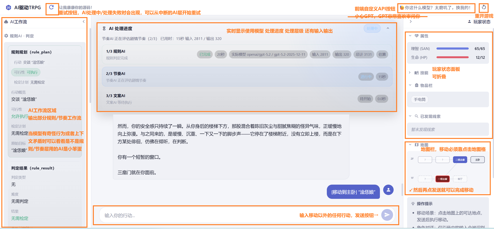

# AI驱动TRPG跑团系统

> 本项目是 [AstrBot](https://github.com/AstrBotDevs/AstrBot) 的插件，需要安装到 AstrBot 中使用。
> 请先部署 AstrBot，然后将本插件安装到 AstrBot 的插件目录中。

基于三层 AI 架构的 TRPG 网页插件，面向 COC 风格的开放探索、NPC 协作与动态剧情生成。

当前版本：`v3.0.0`



## 三层 AI 架构

每一轮玩家行动依次经过三层 AI 处理，各层职责严格分离：

```
玩家输入
   │
   ▼
┌──────────────────────────────────────┐
│  规则层 (Rule AI)                    │
│  · 解析动作意图（verb / target）     │
│  · 裁定行动可行性                   │
│  · 技能检定（掷骰、SAN 检定）        │
│  · 输出硬变化（Hard Changes）        │
└──────────────────────────────────────┘
   │  hard_changes（确定性状态变更）
   ▼
┌──────────────────────────────────────┐
│  节奏层 (Rhythm AI)                  │
│  · 评估当前场景阶段与张力            │
│  · 决定 NPC 行为、位置、反应方向    │
│  · 输出软变化（Soft Changes）        │
│  · 评估结局请求合法性               │
└──────────────────────────────────────┘
   │  soft_changes（叙事驱动的状态变更）
   ▼
  合并（Hard + Soft → merged_changes）
   │
   ▼
┌──────────────────────────────────────┐
│  文案层 (Narrative AI)               │
│  · 接收已确定的规则结果与节奏评估   │
│  · 生成最终叙述文本                 │
│  · 不再做任何状态决策               │
└──────────────────────────────────────┘
   │
   ▼
 叙述输出 + 状态更新
```

### 软硬分离设计

系统将世界状态变更分为两类：

**硬变化（Hard Changes）** — 由规则层产出，逻辑确定，不可被叙事覆盖：
- 物品栏增减（`inventory_add` / `inventory_remove`）
- 线索发现（`clues`）
- SAN / HP 数值变化（`san_delta`）
- Flag 置位（`flags`）
- 预设任务启动与分支结算
- 代码层直接派生的变化（如销毁特定对象触发的 flag）

**软变化（Soft Changes）** — 由节奏层产出，叙事驱动，允许 AI 根据场景动态判断：
- NPC 位置移动（`npc_locations`）
- NPC 状态更新（`npc_updates`）
- 场景 flag 推进（`flags`）
- 威胁实体状态（`threat_entity_updates`）

两类变化通过 `_merge_world_changes` 合并，硬变化优先级高于软变化。文案层仅读取最终合并结果，不参与任何状态决策。这确保了：规则可审计、叙事有弹性、状态更新可追溯。

### 节奏层 preview 机制

节奏层调用前，系统会将 `hard_changes` 预应用到游戏状态（`_preview_state_with_world_changes`），让节奏层看到规则层已确定的变化后再做场景评估，避免节奏层基于过时状态判断。

## 核心能力

- **分层重试**：任意层失败均可从该层起点重试，前序层结果从缓存恢复，不重复消耗 token
- **自定义 API**：玩家可在前端配置自己的 OpenAI 兼容 API，按层独立或统一配置，保存在浏览器本地
- **地图系统**：BFS 可达性、战争迷雾、隐藏地点条件显现、SVG 地图交互
- **NPC 系统**：记忆、信任等级、Reveal 机制、同伴模式（跟随 / 等待 / 诱敌）、预设任务、确定性线索（`known_clues`）
- **预设任务**：`solo_search`（NPC 独立行动）、`cooperative_escape`（协作逃离）、`decoy`（诱敌），各阶段可配置 movement_note 注入节奏层
- **威胁实体系统**：逐格追逐、堵门判定、接触检测、警戒状态机
- **微场景系统**：硬导向场景，不参与普通地图寻路，用于关键分支入口
- **SAN 系统**：技能检定掷骰、SAN 值变化、崩溃结局触发
- **结局系统**：地点触发、硬条件校验、模组可配置的结局标题/描述/后日谈、影响维度数据驱动
- **存档系统**：Web 会话持久化、显式继续存档、断连后重试状态恢复、过期存档自动清理
- **WebUI**：AI 工作流进度面板、聊天区、玩家状态区、地图点击交互、戏剧演出效果
- **玩家自定义角色卡（COC7）**：8 属性 + LUCK + 25 项内置技能 + 自定义技能、6 大职业内置 + 自由自定义、双点池硬守恒（兴趣点 INT×2、职业点按公式）、6 项调查员背景、起始物品、随机生成 / 模板导出 / JSON 导入；按年代池抽随机卡（modern / 1920s 各含等量中外内容）

## v3.0 更新摘要

- **角色卡系统**：完整 COC7 调查员卡体系，前后端校验与硬守恒，支持手填 / 随机 / AI 离线生成 / JSON 导入四条创角路径
- **年代项 (era)**：可选 `modern` / `1920s` / `custom` 自定义文本，默认现代；身份块拼接进 AI prompt 让叙事按年代走
- **池守恒强化 (v4)**：兴趣池 (`INT×2`) 与职业池 (`公式`) 都强制 hard-reject 超额；自定义技能 base=0 一并计入对应池；取消 spillover 机制让错误信息精确指向真实位置
- **AI 模板提示**：`make_blank_template_with_hints` 现在导出内置 25 项技能精确表（含 base），并标注"无任何射击类内置技能"等高频踩坑
- **随机池按年代分组**：`data/random_pool.json` 重构为 `by_era.{modern, 1920s}`，每池含等量中国 + 国际内容（modern 60 名 / 60 地名 / 120 句背景；1920s 60 名 / 50 地名 / 120 句背景）
- **WebUI 角色卡面板**：模态对话框含基础信息 / 属性 Roll / 技能配点表（双点池实时显示）/ 6 项背景 / 物品栏，前端镜像校验

## 配置项

主要配置字段：

| 字段 | 说明 |
|------|------|
| `module_name` | 模组文件名（不含 .json） |
| `rule_ai_provider` | 规则层 AI 提供商 |
| `rule_ai_provider_fallbacks` | 规则层 fallback 提供商列表 |
| `rhythm_ai_provider` | 节奏层 AI 提供商 |
| `rhythm_ai_provider_fallbacks` | 节奏层 fallback 提供商列表 |
| `narrative_ai_provider` | 文案层 AI 提供商 |
| `narrative_ai_provider_fallbacks` | 文案层 fallback 提供商列表 |
| `webui_port` | WebUI 监听端口 |

完整字段定义见 [_conf_schema.json](./_conf_schema.json)。

## 仓库结构

```text
aitrpg/
├── main.py                # 插件入口、三层 AI 调度、重试机制
├── metadata.yaml
├── _conf_schema.json
├── ai_prompts.json        # 各层 AI 的 prompt 模板
├── theatrical_parser.py   # 戏剧标记解析（演出效果）
├── ai_layers/
│   ├── rule_ai.py         # 规则层实现
│   ├── rhythm_ai.py       # 节奏层实现
│   ├── narrative_ai.py    # 文案层实现
│   ├── provider_failover.py
│   └── usage_metrics.py
├── data/                  # COC7 规则数据（v3.0 新增）
│   ├── professions.json   # 6 大内置职业（侦探/记者/医生/古董商等）
│   ├── skills_coc7.json   # 25 项内置技能 + base 公式
│   └── random_pool.json   # 随机生成池（按年代分组、含等量中外）
├── game_state/
│   ├── session_manager.py # 游戏状态、NPC、预设任务、存档
│   ├── character_card.py  # COC7 角色卡校验/派生/随机/模板（v3.0 新增）
│   ├── location_context.py
│   └── save_store.py      # 存档持久化与自动清理
├── webui/
│   ├── server.py          # Quart API 接口（含 /character-card/* 端点）
│   └── static/
│       └── js/character_card.js  # 角色卡前端模块（v3.0 新增）
├── modules/               # 模组 JSON 文件
│   └── README.md          # 模组字段说明文档
└── rules/                 # 规则文件
```

## 后续开发计划

- **DND 系统支持**：扩展 DND 5e 规则体系
- **更多模组**：扩充可用模组库，支持不同风格和规模的冒险
- **结构优化**：持续重构代码，提升可维护性和扩展性
- **层级合并选项**：开放节奏层与文案层合并的配置，减少 API 调用次数，降低延迟和成本

## 文档

- 模组字段说明：[modules/README.md](./modules/README.md)

## 友情链接

- [Linux.do](https://linux.do/)

## 许可证

AGPL-3.0
